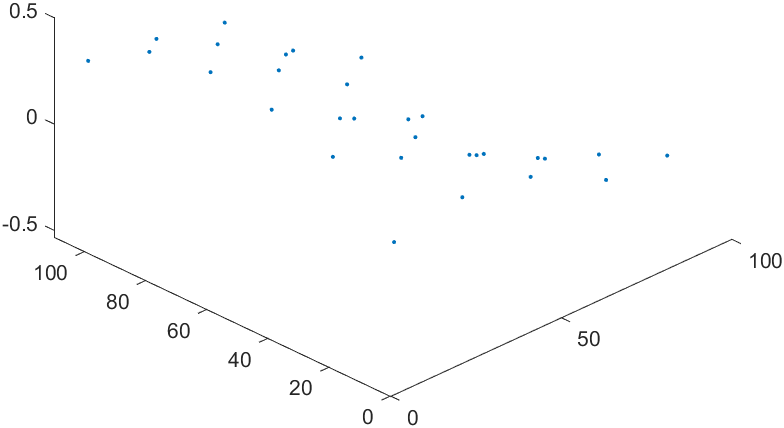
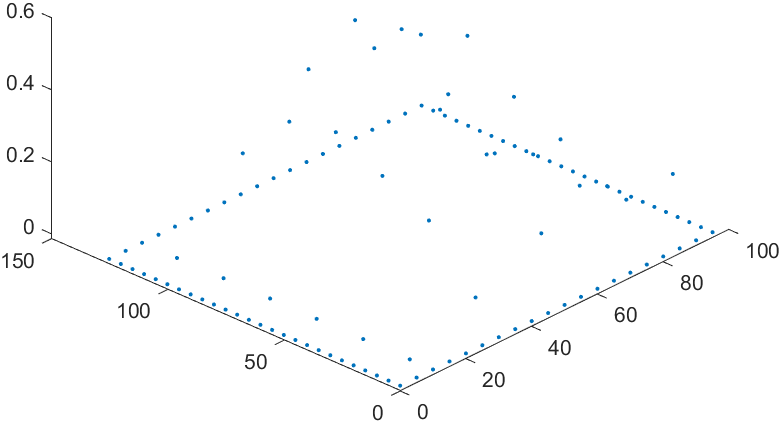
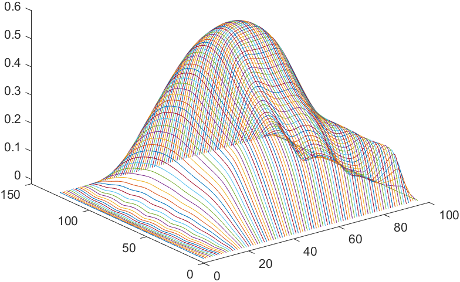
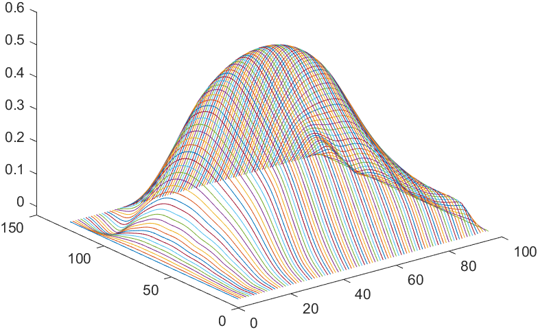
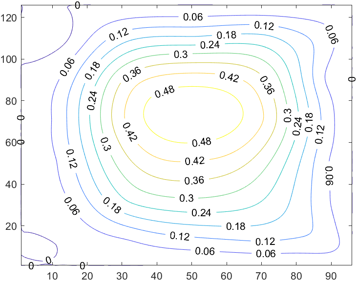

Readme[^1]
---

We collect some vector data from car's gero sensor per 20x20 square. (See conversion at xlsx file, results at 0602a.txt & 0602b.txt)

```csv
# 0602b.txt (L8, L13)
30	10	0.274167451
30	30	0.163476438
30	50	0.153423922
30	70	0.041642579
30	90	-0.229904428
30	110	-0.337622237
```

This photo shows dx/dz vector data:



We use `cumtrapz` to get the integral data per `dx` and `dy`, and add some edge points. __Note that it dismiss the difference between `0 - 10` and `10 - 30, 30 - 50, ...`.__

This photo shows per `dx` data:



Finally, fit the dot to surface(step = 1), and get the average surface. By `contour` a level map is given.



_`dx` surface_



_average surface_



_level map_

[^1]:source and data are given by **MIT License, 前进四组 2021**
